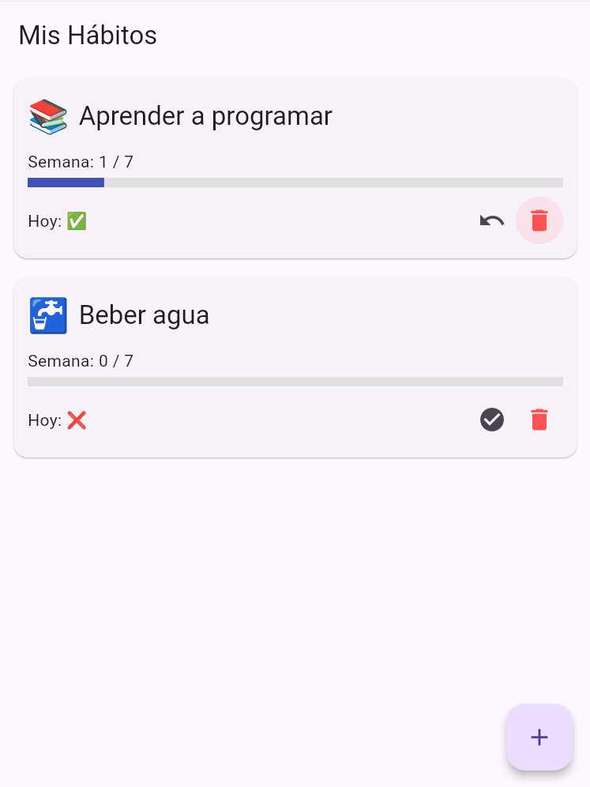

# 🧠 HabitUp – Rastreador de hábitos personales

HabitUp es una aplicación móvil construida con Flutter que permite a los usuarios crear, seguir y completar hábitos diarios. Ideal como ejemplo de arquitectura limpia, manejo de estado moderno y persistencia local en Flutter.



---

## ✨ Características

✅ Agrega hábitos con nombre e ícono personalizado (emoji)  
✅ Marca hábitos como completados día a día  
✅ Visualiza tu progreso semanal con una barra de avance  
✅ Guarda todo localmente usando `SharedPreferences`  
✅ Elimina hábitos con confirmación  
✅ Código modular con `Provider` para manejo de estado  
✅ Listo para expandirse a Firebase, notificaciones y más

---

## 🧱 Tech Stack

- 🐦 Flutter 3.x
- 🔁 Provider para manejo de estado
- 💾 Shared Preferences para almacenamiento local
- 🧪 Flutter Test para pruebas (soporte incluido)
- 🧭 Navegación con rutas sencillas

---

## 🧩 Estructura del proyecto
```text
lib/
├── models/ # Definición de modelos (Habit)
├── pages/ # Pantallas (Home, NewHabit)
├── providers/ # Provider con lógica de estado
├── services/ # Persistencia local
├── widgets/ # Componentes reutilizables (tiles, barras)
```

---

## 🚀 Cómo correr la app localmente

1. Clona el repo:
```bash
git clone https://github.com/tuusuario/habitup_flutter.git
cd habitup_flutter
```

2. Instala dependencias:
```bash
flutter pub get
```

3. Ejecuta en emulador o dispositivo:
```bash
flutter run
```

---

👨‍💻 **Autor:** Roberto Soto  
*Ingeniero en informática con 8 años de experiencia en desarrollo de software y enfoque actual en apps móviles multiplataforma.*
[LinkedIn](www.linkedin.com/in/roberto-soto-b28b74a5) | [GitHub](https://github.com/Narubyx)


🪪 **Licencia:**  
Este proyecto es open-source bajo la licencia MIT.